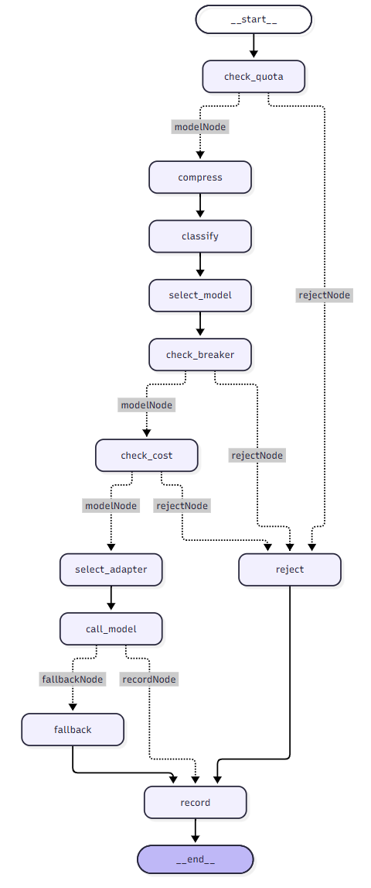

# LLM Router Platform

企业级多模型 LLM 路由平台。根据查询类型、用户等级和 token 数把请求路由到合适的模型，
带配额 / 熔断 / 预算三重策略拦截、失败自动降级、LoRA 适配器管理和监控看板。

> - 课程作业项目。核心编排用 LangGraph 实现（`src/llm_router_part7_langgraph.py`）。
> - 作业在 Claude 的提示下完成。代码由我编写,Claude 提供讲解和排错;训练/评测数据按我定义的标注规则由 Claude 批量生成。
---

## 请求流程




三条策略检查（配额 / 熔断 / 预算）任一不过就走 `reject`，但**仍然记录日志**——
不记录的话看板上看不到拦截量。`call_model` 失败后走 `fallback` 降级到同 tier
内更便宜的模型重试一次。

## 目录结构

| 路径 | 内容 |
|---|---|
|`data/eval/`|专门 evaluate 分类训练结果的数据|
|`data/train/`|LoRA 训练的数据|
|`src/router_prompt.py`|提示词模板与 domain 映射的单一来源|
|`src/train_router_lora.py`|分类适配器训练 |
|`src/train_answer_lora.py`|不同领域（domain）回答适配器训练|
|`src/classify_lora.py`|LoRA 分类推理|
|`src/eval_router.py`|评测脚本(分类函数作为参数,两种实现共用)|
| `src/llm_router_part1_router.py` | 意图分类、模型选择、兜底模型选择 |
| `src/llm_router_part2_inference.py` | 三家 provider 的调用（openai / anthropic / vllm-ollama）、成本预检 |
| `src/llm_router_part4_monitor.py` | 配额、熔断器、SLA、日志落盘 |
| `src/llm_router_part5_deploy.py` | FastAPI 服务 |
| `src/llm_router_part6_adapters.py` | LoRA 适配器注册 / 灰度 / 转正 / 回滚 |
| `src/llm_router_part7_langgraph.py` | **LangGraph 编排，项目入口** |
| `src/utils/token_tools.py` | 分词、上下文窗口校验、输出 token 预估 |
| `streamlit_ui/app.py` | 七页监控看板 |
| `config/config.yaml` | 模型注册表、路由规则、策略阈值 |

## 运行

### 1. 依赖

```bash
pip install -r requirements.txt
```
Windows/Linux 上默认装的可能是 CUDA 版(几个 G),没有显卡的话可以用 pip install torch --index-url https://download.pytorch.org/whl/cpu 装 CPU 版

### 2. 本地模型（可选，但推荐）

`config.yaml` 里 `provider: vllm` 的两个模型目前走本地 ollama：

```bash
ollama pull mistral
ollama pull llama3.1
```

### 3. API key（可选）

只有路由选到 `gpt-4-turbo` / `claude-3.5-sonnet` 时才需要：

```bash
cp .env.example .env   # 然后填入真实 key
```

### 4. 跑起来
Adapter 已经包含在这个项目里。如果希望重新建一遍，先走这个程序：
```bash
cd src && python llm_router_part6_adapters.py
```
然后依下面方式跑完全程：
```bash
cd src && python llm_router_part7_langgraph.py   # 跑一次完整流程
streamlit run streamlit_ui/app.py                # 监控看板
```

运行日志写到 `data/call_logs.csv`（首次运行自动创建，已 gitignore）。

零配置演示:user_tier='free' + 代码或法律类问题,这条路径完全本地。首次运行自动下载 Qwen2.5-0.5B(约 1GB),不需要 ollama,也不需要 API key。
其它情况:free 档的其它问题走 mistral-7b,需要装 ollama;
premium / enterprise 档会路由到 gpt-4-turbo / claude,没有配 .env 时会按设计走降级链,最终记为 error——这是预期行为,不是故障。

---

## 设计说明
### LoRA 适配器:自训分类器与领域回答
#### 1. 为什么不用课件的 Mistral-7B，而是 Qwen2.5-0.5B-Instruct
- 我的机器没有 CUDA + 显存账(16GB 装不下 fp16 的 7B)
- 但更重要的是:模型大小该由任务复杂度决定,classify 这个工作只要输出一个 0到3的整数，不需要很大的模型。

#### 2. 第一个LoRA 训练：分类器
- 在分类的 function 里面采用了两层拆分(_classify_int / classifyChat),换实现只动内层
- config 的 router.classifier 可切 ollama | lora
- 做了三轮 training，并且根据相同的12个问题做了对比表(正确率： 10/12 → v1 10/12 → v2 11/12)
- v1 和提示词版总分相同但错的题完全不重叠，所以不能只看总分，要看具体问题出错在哪里。

#### 3. 评测方法
- 一共用了12 句评测集,大部分是清晰句：很明确可以判断分类。少部分是边界句：分类比较模糊，模型可能会判断成多个类型。清晰句和边界句分开统计
- 在训练和测试题目中，采取单变量消融:只改一个词定位失败原因(403 vs 404)
- 发现并修复不可复现:有一个问题反复问了8次，却得到了不同的结果。由于 base model 是Qwen2.5, 它自带的 generation_config 中的默认值使得聊天有多样性。所以一个问题反复问它会得到不同的结果，但这导致结果很可能不准确，因为可能只是像中奖一样凑巧正确了。修复办法是在`PeftModel`后续的 generate()中使用 `do_sample=False`,每步取概率最高的token。

#### 4. 第二个LoRA 训练：回答适配器 Adapter
- 由于我的电脑限制，仍然采用 Qwen2.5 模型而不是 mistral-7b
- base vs adapter 的对比(那段降薪的回答)
- 只用了20 条数据，刻意过拟合（epoch = 12）。
- 演示机制不是灌知识，不具备真正提供 legal 之类的回答。
- 一共3个domain，我只训练了 legal 和 code。没训练 customer_service

#### 5. 与课件参考的出入
课件 `Lora/` 下三个脚本是这条流程的参考实现。照着跑通的过程中发现四个问题，
都在本项目中做了修正，记录如下。

**a. 训练模板与推理模板不一致**

`01_train_router_lora.py:40-95` 的训练数据里，每条样本的提示词是：

    User Question: {问题}
    Please output only the classification number, must be one of 0, 1, 2. Do not output any extra text:

而 `02_infer_router.py:21-25` 推理时用的是另一套：

    Determine the type of user question: Only int values can be output.： 0chat, 1code,2legal
    question:{问题}
    label:

LoRA 微调的本质是让模型在**特定输入格式**下产生特定输出。训练时教它认 A 格式，推理时喂 B 格式，学到的关联有相当一部分用不上。

本项目的做法：把模板抽成 `src/router_prompt.py` 里的 `ROUTER_PROMPT_TEMPLATE`
常量，训练脚本和推理函数都从这里 import，从结构上杜绝不一致。
回答适配器的 `ANSWER_PROMPT_TEMPLATE` 同理。

**b. 推理的解析逻辑恒返回 1**

`02_infer_router.py:29-32`：

```python
text_out = tokenizer.decode(outputs[0], skip_special_tokens=True)
if '1' in text_out:
    return 1
```
generate() 返回的是输入 + 新生成拼接后的完整序列，所以 `outputs[0]`
解码出来包含整个提示词。而提示词里写着 0chat, 1code,2legal——里面有字符 1。

于是 '1' in text_out 恒为真，函数永远返回 1，与模型的实际输出无关。
这个 bug 不会报错，只会安静地让分类器失效。

本项目的做法：先取输入长度 `n = inputs['input_ids'].shape[1]`，
只解码 `outputs[0][n:]`（新生成的部分），再扫描第一个 0–3 字符。
见 `src/classify_lora.py`。

**c. 训练循环是留白的**

课件给了模型加载、LoRA 配置、数据构造和保存，中间的训练部分需要自己补。
本项目在 src/train_router_lora.py 中实现，关键点：

- 把 messages 转成 input_ids / labels，并且只对答案部分计算 loss：
提示词对应的位置全部置 -100（PyTorch 交叉熵约定的忽略值）。
不做这一步的话，模型的学习量主要花在复述提示词上——而提示词在所有样本里
几乎相同，这部分信号既无用又会淹没真正的分类信号
- DataCollatorForSeq2Seq(tok, label_pad_token_id=-100)：不同样本长度不同，批处理时需要补齐。labels 必须用 -100 补，否则模型会因为"没预测对填充符"
而受罚
- 超参取自 config.yaml 的 adapters.training 段

**d. requirements.txt 未包含 bitsandbytes**

课件的模型加载是 torch_dtype=torch.float16 + device_map="auto"，
即 fp16 全量加载 7B，需要约 14.5GB 显存。在 16GB 及以下的显卡上必须改用
4bit 量化（QLoRA），而这需要 bitsandbytes，课件的依赖清单里没有它。

本项目走 CPU + 0.5B 路线，不需要量化，因此不受影响，但这一点在
按课件配置尝试 GPU 路线时会立刻暴露。

**e. 每次调用都重新加载基础模型**

03_gateway_demo.py 的 18-28 行和 53-60 行各加载了一次完整的 7B 模型。
但每次请求重新加载数十亿参数不现实。

所以我改成基础模型只加载一次，切换领域时用 set_adapter() 换适配器。PEFT 支持在同一个基座上挂载多个适配器。本项目的 classify_lora.py
已经采用模块级加载（只加载一次），后续接入回答适配器时会沿用同一思路。

#### 6. 分层 routing 策略：
- 免费用户用本地的 Qwen2.5-0.5B 加 adapter，零成本。
- 付费用户用 GPT-4 或者 Claude。

#### 7. 端到端完成例子：
``` 
 Q: How do I reverse a string in Python?
     domain  : code                      ← 自训 LoRA 分类器
     model   : qwen2.5-0.5b              ← config 规则 + tier 过滤 + priority
     adapter : qwen2.5-0.5b-code-v1      ← registry 查到
     answer  : Use the `[::-1]` slicing technique... It works on any iterable
                                         ← 训练数据里那条答案的风格

  Q: Can my employer reduce my salary without telling me first?
     domain  : legal
     adapter : qwen2.5-0.5b-legal-v1
     answer  : Most companies must give notice... This is general information and not legal advice.
                                         ← 免责声明 ✅
```
### Quota/Cost 检查为什么放在 classify 之前
这样可以先看是否需要停止、拦截请求，使得 latency 大减，同时不浪费 token 和金钱。

### fallback 的三个设计决策
| 原待决 | 结论 | 理由 |
|---|---|---|
| fallback 成功后 `status` 记什么 | 记 `success`；**CSV 加一列 `fallback_model`** | 一行一请求，`status` 反映用户的真实体验（兜底救回来了就是成功）；主模型失败的信号由新列承载，不污染 `status` |
| `selected_model` 写主模型还是兜底模型 | **永远写主模型**，兜底模型进新列 | "谁被路由选中"和"谁最后干了活"是两个问题，挤一列必然丢信息 |
| 兜底模型就是主模型时 | **跳过兜底，直接记 error** | 同一模型再打一次叫 retry，是另一个模式，不混进 fallback 节点。free 只有 mistral-7b，天然无兜底可选 |

### 与流程图要求的有意分歧
| # | 老师 | 我的实现 | 理由 |
|---|---|---|---|
| 1 | `classify → policy_check` | `check_quota → classify`，先查quota，省时间，也省钱 | 实测拒绝 **61ms vs 34s**，快 500 倍。配额超了不该先烧一次 LLM 分类 |
| 2 | 配额不足 → 直接 `END` | `reject → record → END` | 不记录的话仪表盘看不到拦截量，也发现不了配额设置不合理 |
| 3 | 只有配额检查 | 配额 + 熔断 + 预算 | 预算检查必须在调用前，钱花出去就收不回；且预算拒绝不能记成 `error`，否则会污染熔断器的连续失败计数 |
| 4 | 分类词表 `0chat / 1code / 2legal` | `0general / 1code / 2legal / 3customer_service` | 老师那九条训练样本是演示数据不是需求规格。实测客服类问题（Fedex 丢件）在三分类里无处可去，只能落到 chat；而客服是 LLM 路由最常见的真实用途。详见第四节已决 |
| 5 | 基座固定用 `mistralai/Mistral-7B-Instruct-v0.3` | 本机版用 **Qwen2.5-0.5B-Instruct**（CPU 可训），GPU 版才用 7B | 硬件约束（本机 Intel Arc 核显，无 CUDA），但更根本的理由是**模型大小该由任务复杂度决定**：路由分类只需输出一个 0到3 的字符，0.5B 足够。 |

### 实测数据
#### 三种拒绝路径的延迟

| 拒绝原因 | 延迟 | 说明 |
|---|---|---|
| 配额超限 | **61 ms** | 在 classify 之前拦下，不烧 LLM |
| 熔断器打开 | 15 s | 需要先分类、选模型才知道该查哪个模型的熔断状态 |
| 预算不足 | 7.5 s | 同上，且必须在调用前算清成本 |

对照组：正常请求走完全程约 **34 s**（本地 ollama）。
配额拒绝比它快 **500 倍**：这就是把 `check_quota` 提到 `classify` 之前的收益。

#### fallback 四条路径（记录到数据里面的rule）

| 场景 | selected_model | fallback_model | status |
|---|---|---|---|
| 兜底成功 | gpt-4-turbo | mistral-7b | `success` |
| 兜底也失败 | gpt-4-turbo | mistral-7b | `error` |
| free 档无兜底可选 | mistral-7b | *(空)* | `error` |
| 正常成功 | mistral-7b | *(空)* | `success` |

#### 熔断器改造前后对比

加入 fallback 后，熔断器原来的失败判断（只看 `status == 'error'`）会失效：
主模型连续失败但每次都被兜底救回时，`status` 全是 `success`，
**熔断器数出来的连续失败是 0，永远不会打开**。

用合成数据验证（5 次"主模型失败但被兜底救回"）：

| 判断逻辑 | 数出的连续失败 | 结果 |
|---|---|---|
| `status == 'error'`（旧） | **0** | 不熔断 ❌ |
| `status == 'error' or pd.notna(fallback_model)`（新） | **5** | 正确熔断 ✅ |

#### SLA 指标的一个陷阱

同一批日志里：

| 请求 | 结果 | 延迟 | `sla_met` |
|---|---|---|---|
| A | 兜底成功 | 29 s | `False` |
| B | **彻底失败** | 1.8 s | **`True`** |

**失败得快，反而"达标"了。** SLA 达成率只在成功请求上有意义——
混着失败请求一起算，系统越烂数字越好看，因为失败是最快的响应。
看板上的 SLA 面板必须先按 `status == 'success'` 过滤。

#### LoRA 分类器三轮对比

12 句评测集，清晰句 8 / 边界句 4：

| 轮次 | total | 清晰句 | 边界句 | 错的题 | 可复现 |
|---|---|---|---|---|---|
| 提示词版（ollama llama3.1） | 10/12 | 8/8 | 2/4 | #7, #11 | 否 |
| LoRA v1（200 条训练数据） | 10/12 | 8/8 | 2/4 | #6, #12 | ❌ 采样 |
| **LoRA v2（237 条）** | **11/12** | **8/8** | **3/4** | **#11** | ✅ 贪心解码 |

v1 和提示词版三个数字完全相同，但**错的题完全不重叠**。只看总分会得出"没区别"的错误结论。

v2 的改进来自一次**有假设的补数据**：先诊断出 legal 类里"检索内部条款"
这个子类型样本太少、且与客服类共用零售词汇（returns / refunds / our customers），
据此补了 22 条针对性样本，结果正是预测的 #6 和 #12 两句翻转，且 #7 没有回退。

#### 单变量消融：#11 为什么顽固

`I keep getting 404 error on placing order webpage` 被判成 code。
一次只改一个词，其余一字不动：

| 输入 | 结果 |
|---|---|
| 训练集原句（含 **403**） | 3 ✅ |
| 评测原句（含 **404**） | 1 ❌ |
| 只把 404 换成 403 | **3 ✅** |
| 只去掉 `webpage` | **3 ✅** |

`403` 在训练数据里出现过，`404` 一次都没有。模型学到的不是
"用户在我们网站上遇到 HTTP 报错 → 客服"，而是更表面的"看到 403 → 3"。
**这是记忆与泛化的直接证据。**

未修复此项是有意的：为了让 #11 判对而往训练集加 404，等于照着测试集补数据，
之后的 12/12 不再衡量泛化能力。

## 截图

见 `screenshots/`。

## 待完成

- [ ] `compress` 节点（小模型压缩上下文减 token）
- [ ] Streamlit 接真实运行数据（现在读的是样例数据）
- [ ] `tests/`
